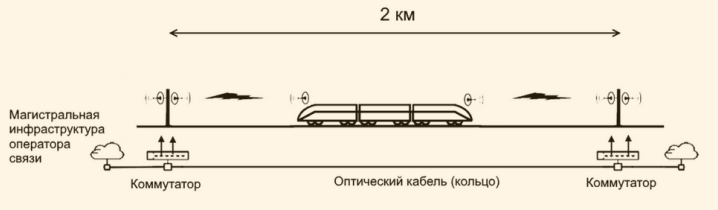
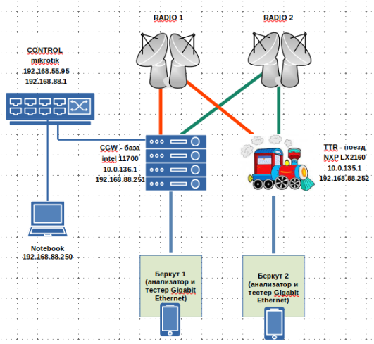
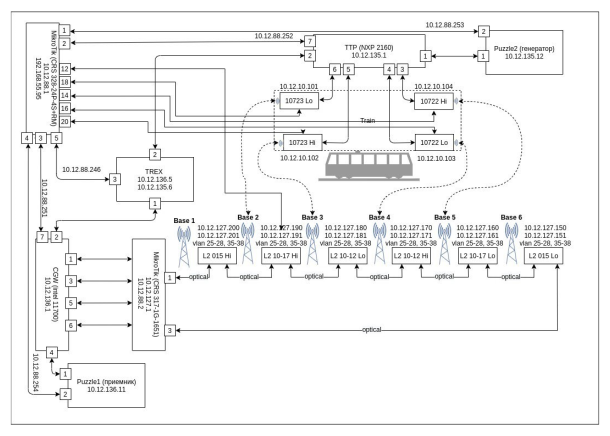
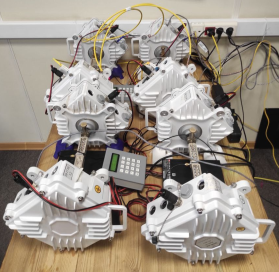
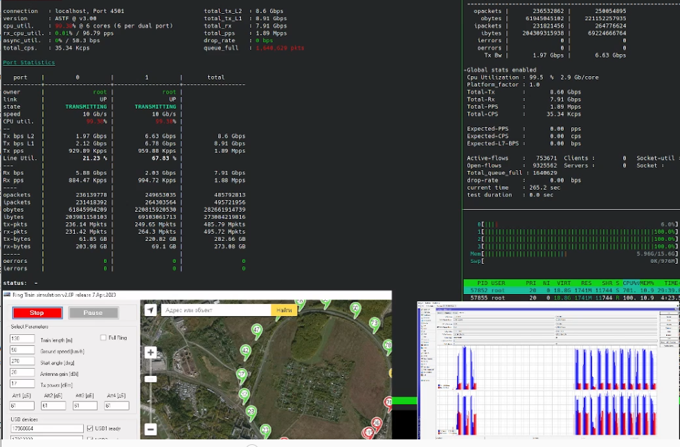

## Вместо пролога

*Скорости растут, поезда несутся, а дремучий "французский" GSM (а он был таковым на этапе своего зарождения в начале 90-x)  вытеснил CDMA.*

*Теперь уже мало кто вспомнит, что впервые в России возможность мобильного интернета на скоростях мобильной станции до 200 км\ч была доступна только в сетях стандартов: CDMA-2000 AKA CDMA-450 AKA IMT-450i .*

## Проект "поезд-земля" и сложные задачи передачи данных

В большом проекте по обеспечению надежной высокоскоростной (10Гбит\с) связью "поезд-земля", наша команда отвечает за разработку решения для высокоскоростной передачи данных со сверх быстрым переключением каналов (в сотовой связи аналогом является механизм переключения радиотракта между БС и МС, "перехват", он же - "handover") . 

Проект передачи данных вдоль линии ЖД характеризуется впечатляющими обывателя цифрами  - это сотни километров оптоволокна, тысячи РРС (Радио-релейных станций), служба мониторинга и управления OSS/BSS, десятки поездов и бригад обеспечения на дрезинах). И наша небольшая (в масштабах реализации первой в РФ Track Side Network), но сложная задача - **сделать подвижный поезд и все что в нем находится надежным "стационарным" сетевым клиентом**.

:::tip Пресса и материалы по теме

- [Статья](https://habr.com/ru/articles/739496/) на Хабре про технологию "поезд-земля" и сравнение ее с WiFi и LTE.
- [Ролик](https://www.youtube.com/watch?v=t48YXALtb-M) на Youtube
- [Описание Радио-мостов "поезд-земля (pdf)"](https://dokltd.ru/data/files/docs/dok-train-to-ground-ppc-10gbit.pdf) на сайте dokltd.ru

:::

В своих разработках мы подразумеваем современный поезд, который движется на высоких скоростях (до 300км\ч).

## Передача данных "земля-поезд"

:boom: Термин РРС расшифровывается как **Радио-Релейная Станция**.

Суть технологии передачи данных "земля-поезд" в том, что на поезде стоит радио-релейное оборудование (РРС), которое "смотрит" вперед и назад. В каждый момент
времени мы "видим" и "теряем" базовые станции впереди поезда и сзади поезда и необходимо переключать путь прохождения трафика между парами РРС. Путь прохождения трафика (здесь и далее **ППТра**) - путь, образованный парой РРС на базе (столбе) и на поезде (на носу или кормовой части). 

В решении используются две основных функциональных компоненты:

- **CGW (Central GateWay)** - маршрутизатор, устанавливаемый на "земле" (в диспетчерской или в дата-центре)

- **TTR (Train Track Router)**  - маршрутизатор, устанавливаемый на подвижном объекте (в нашем случае это первый и последний вагоны поезда)

:boom: Далее довольно часто мы будем использовать термин  ППТра - расшифровывается **как П[уть] П[рохождения] Тра[фика]**.

Упрощенная схема сетевой части выглядит так

:::tip Пояснения к картинке

На самом деле на поезде 4 РРС с разной поляризацией (две смотрят вперед и две назад). Внутри "поезда" наша славный роутер, который переключает ППТра. CGW-база - "наземный" сервер в диспетчерской, который собственно и является шлюзом в Интернет, а также потребителем трафика с камер поезда. 

Для тестирования качественных показателей используются приборы BERcut-ETX и трафик-генератор T-Rex с различными профилями, что позволяет на разных моделях трафика оценить  количество потерь при переключении ППТра.

:::

Вот настоящая схема с генератором трафика T-REX.

:::tip Пояснения к cхеме

На подвижном маршрутизаторе (TTR) - реализован демон  маршрутизации с нашим алгоритмом переключения ППТра. Алгоритм разработан с использованием DPDK на ОС Linux.

На стационарном сервере или как мы говорим "на базе" (CGW) - программная реализация, генерирующего потока heart-beat,  с нашем же алгоритмом переключения ППТра, разработанным с использование DPDK на ОС Linux

:::

:::note Почему просто не взять коммерческий шлюз или Linux-маршрутизатор 

Беда стандартных протоколов в том, что переключения  маршрута  в рамках обозначенных требований  очень медленное (даже на мощных сетевых маршрутизаторах), а если мы начинаем пользоваться IP-стеком Linux, то получаем снижение скорости при интенсивном роутинге 10Гбит и (что важнее) также переключение в районе 50мс, что для нас медленно. Для любой стационарной сети это хорошее время переключения (мы используем протокол **BABEL** для **Mesh** сетей), но мы предположили,  что при использовании DPDK это время можно кардинально уменьшить. 

:::

:::info Материалы, что же такое DPDK и почему он быстрее обычного сетевого стека

- [Статья по DPDK на Habr #1](https://habr.com/ru/companies/selectel/articles/313150/)
- [Статья по DPDK на Habr #2](https://habr.com/ru/companies/intel/articles/302126/)
  

:::

:::caution Почему DPDK, а не VPP + DPDK  или OpenVSwitch + DPDK?

- В рамках поставленной задачи решили взять фреймворк с наилучшими в индустрии характеристиками работы с сетевыми контроллерами и исключить издержки OS. 
- Логика управления путями трафика не опирается на штатные механизмы рутинга на L2\L3 с использованием и сопровождением различного сорта таблиц а-ля ARP и\или рутинговых.
- Функционал DPDK минимален и достаточен для реализации необходимой логики при минимальных издержках, которые могли бы быть привнесены программными слоями сверху DPDK.

:::

Наша задача - обеспечить непрерывный и полно-дуплексный поток данных 10Гбит/c, переключая маршрутизацию от базовой станции "впереди" к базовой станции "сзади" и обратно.

То есть, говоря сетевым языком нам надо переключать маршрут (на L2 или L3)  потока 10Гбит примерно раз в 5-10 секунд максимально быстро (с минимальными потерями). Интервал определяется скоростью движения поезда и интервалом между наземными РРС . 

В этом проекте мы применяем программный фреймворк DPDK и мощную платформу NXP LX2160. Мы разработали
свой протокол, которые оптимизирован исключительно на эту задачу (с минимальными задержками переключает ППТра) .  Мы разработали свою собственную логику управления переключениями ППТра-ми . При этом
мы получаем скорость переключения ППТра  районе 1-10мс (миллисекунд), на лабораторном стенде.

:boom: FleaPath - наше название, потому что трафик скачит как блоха...

:boom: Еще один термин - **heartbeat**, **хёрт-бит** или **HBT**. Служебный трафик для определения "живости" маршрута с минимальной длиной пакета и максимальной частотой генерации пакетов. 

## Что получилось 

В общем случае, при интервале HBT в 5000 микросекунд (5 миллисекунд) удаётся получить переключение исходящего ППТР-а в пределах 7000-10000 микросекунд (7-10 миллисекунд). При интервале 1 мс, мы получаем переключение в районе 1,5-3 мс, что является рекордным результатом на настоящем историческом этапе.  Разумеется эта цифра получена в условиях лабораторного стенда, но тем не менее наш стенд максимально физически приближен к натуральному воплощению.

Меньше интервал рассылки HBT - выше реактивность в петле обратной связи, а значит большая фоновая нагрузка на сетевую инфраструктуру служебным трафиком. Однако при интервале HBT в 1000 микросекунд (1 миллисекунду), ширина канала пропускного трафика примерно 1Мбит\с, что при общей полосе 10Гбит\с является допустимым в рамках начальных требований. 

:::info А есть ли потери (все равно скажут, что потери есть) ?

О потерях. В стендовых испытаниях были диагностированы потери трафика, связанные, как понятно - с тем, что какое-то время ТТР отправлял фреймы по ППТра в никуда (до переключения на "живой" ППТра), в том смысле что связи между парой РРС  не было. Сколько пакетов, сколько трафика в объёме, может быть оценочно высчитано, исходя из интервала HBT и таймаута переключения. Прорабатывается несколько вариантов для повышения надёжности передачи по ППТра, исследования не закончены.

::: 

## Стенды и проверка работы

Для проверки и тестирования мы собрали несколько стендов, один из которых представляет их себя полное физическое воплощение радиорелейной сети с регулируемым затуханием сигнала. Программа тестирования управляет электронными аттенюаторами затухания  в радиорелейной части, обеспечивая полную эмуляцию движения поезда вдоль меняющихся "базовых" станций. 

Радио-релейная часть стенда

Кроме того, для проверки влияния потерь пакетов была собрана сеть из видеокамер, а также генератор трафика T-Rex с профилем "смешанный трафик". Таким образом, мы эмулируем пользователей в интернете в поезде (микс из youtube, веб, видео-общения, скачиваний файлов). Также мы провели испытания, пересаживая весь наш отдел на "поезд". 

Надо с гордостью заявить, что первичными результатами мы воодушевлены. Мы не имеем заметных потерь и снижения скорости. При генерации T-Rex 10гбит смешанного трафика в поезде, наш DPDK-роутер "протаскивает" через себя весь трафик. Базисные принципы концепции были подтверждены, и мы готовимся к воплощению нашего решения в реальных условиях.

При натуральных испытаниях в офисе мы занимали полосу примерно 3 Гбит\с трафика в пике и вообще не ощущали дискомфорта в работе.

...статья пилится...