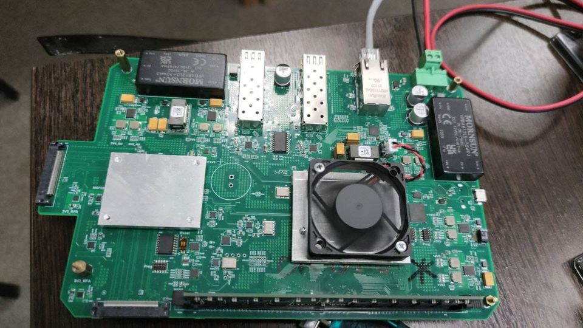

Тяжёлый запуск новой платы, сложный процессор и протоколы запуска. Но мы понемногу движемся к стабилизации процедуры старта и описанию периферии.

<!--truncate-->

Процессор nxp ls1046, память ddr4, сеть 10gb, 3x pci-e. Плата будет базовым роутером для сетей 802.11ad в диапазоне 60ГГц.

К сожалению, плата  сильно отличается от nxp devboard ls1046-ardb, поэтому конфигурации и деревья устройств упали на нас. Там конечно свой космос на стыке железа и конфигурации загрузчиков, чтобы объяснить загрузчикам Линуксу что там вообще есть.

Для примера, прежде чем запустить загрузку Линукс есть 5 стадий загрузчика и uboot. Позже опубликуем некоторые аспекты загрузки этой платы (BL1...3, TF-A).

:wq
