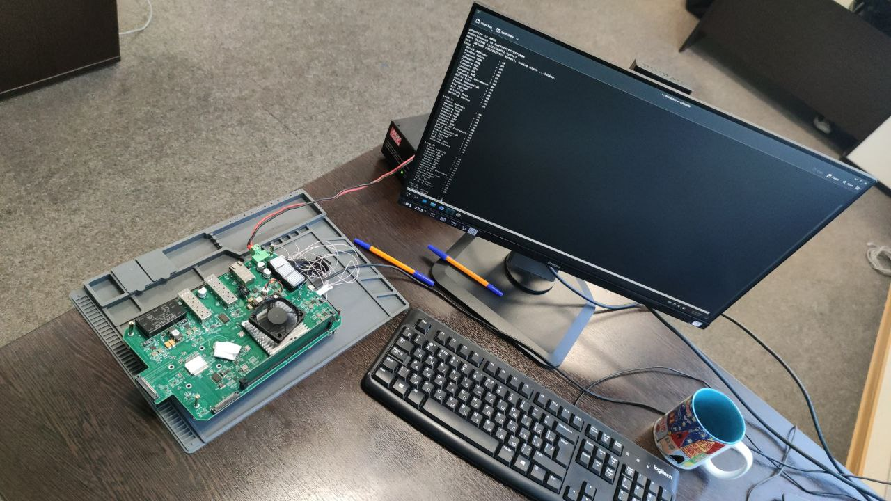
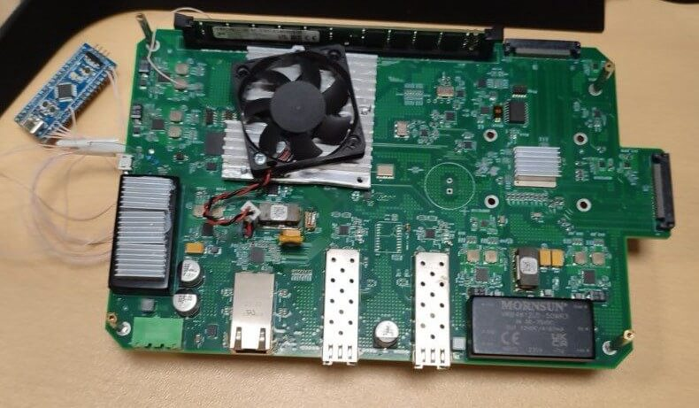
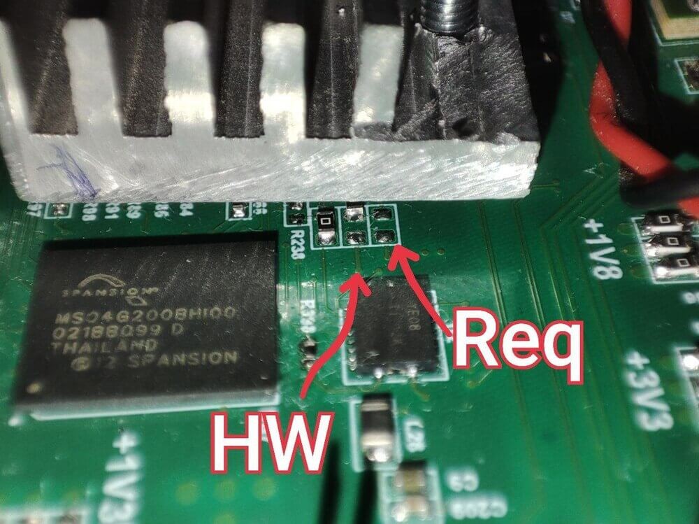
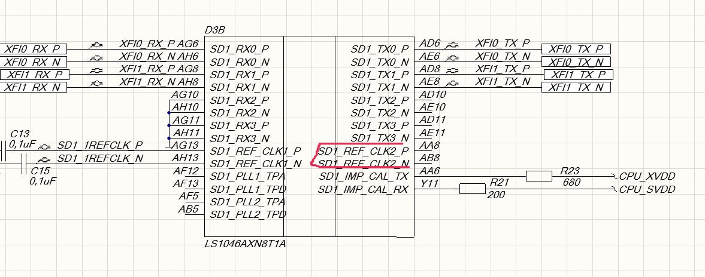
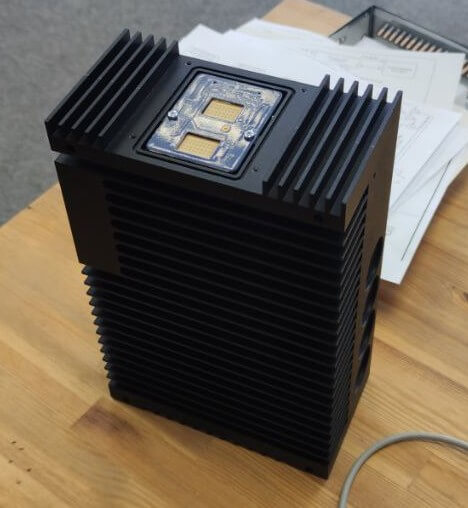
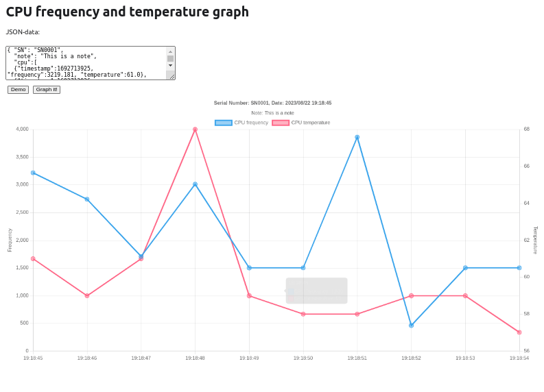

Мы вышли на финишную прямую в подъеме платы на nxp ls1046 и как руководитель группы разработки, как говорится, имею что сказать. Это будет не по технике (отчасти), а о процессе и жизни разработчика.
<!--truncate-->

!

Мы делаем проект, в котором схемотехники делают плату на ls1046 с двумя модемами на 60ГГц (802.11ad) и первоначально я видел задачу нашей группы как чисто программную - выстроить устройства на этих платах в MESH-сеть, запустить процессы раздачи авторизаций, балансировку трафика, раздачи сервисов и прочие высокоуровневые плюшки SDN-а... как же далек от реальности я был...

Началось все с того, что принося сырую плату, нас сразу же включили в работу, так как по мнению схемотехников если побежали циферки в консоли, то дальше программисты должны настроить и залить софт и все будет отлично. Программисты же, наоборот, резонно считают, что если есть прошивка, которая работала на плате разработчика, то эта прошивка обязана работать и на плате, которую сделали схемотехники и нечего приносить иное. И посреди этих двух полярных мнений оказались мы.

В качестве отступления, могу сказать, что наша группа и сама делает платы и занимается трассировкой и мы точно знаем что на первых выпусках любых плат есть ошибки. Притом, они могут быть по схемотехнике (не додумали), по реализации (подумали так, а оно на оно на самом деле совсем не так) и просто ошибки сборки платы (есть еще вероятность некачественных компонент, но такого я не встречал пока).  Хорошая плата, если она делается с нуля в лучшем случае получается с третьего захода, но иногда ошибки таковы что плата идет в помойку, а иногда можно найти косячки, "допилить" и плата становится функциональной или "частично функциональной" и понятно как делать следующий заказ.
**Главное при таком заказе не придумать и не внести новую функциональность**

Итак "больной" поступил с зависанием на стадии BL1 и без возможности зацепиться JTAG-ом. Фирменный софт CodeWarrior просто не видел платы. Так как это уже вторая итерация платы (у первой была неправильно разведена память), то мы не могли так ошибиться по памяти, нужно было искать и запускать. Иногда, это напоминало сериал "Доктор Хаус", иногда хотелось просто отправить плату в утиль, но мы добились стабильной работы и точно знаем что следующий выпуск будет стабильным (при исполнении протокола изменений).

Что делалось и что было сделано.

### ШАГ1. Процедура запуска процессора.

Первое с чего начинается запуск любой платы это старт процессора. Раз он не получает JTAG, значит процедура не соблюдена. Да, у процессора своя процедура запуска с строгой подачей питания и сигналов RESET на нужные пины с нужной задержкой. Запуском  и сбросом платы коллеги поставили управлять отдельный микроконтроллер, который явно работал неправильно. Для справки, в "дев борде" для этого стоит ПЛИС тоже без особенной документации, но сама процедура старта описана в документации полно.

Чтобы не сражаться с схемотехниками их МК был отпаян и припаян наш STM32, для  которого мы залили прошивку , реализующую процедуру старта.



Также были обнаружены недостающие детальки



Итак, через какое-то время мы попали в CW (CodeWarrior), и смогли настроить RCW для памяти, а еще через какое-то время туже процедуру написали для оригинального МK.

### ШАГ2. Питание питание и еще раз питание

Следующая беда которая была с уже загружающейся платой - это нестабильность работы. В прошлый раз это были ошибки в импедансах (задержках) в дорожках, но в этот раз предварительно все было трассировано в xSignals и поэтому копать пришлось в сторону правильного питания. Вообще, питание и обратная связь по питанию, это то, на что легко забить и с чем потом можно бесконечно долго мучиться. Итак, проверка питания и проверка обратно связи по питанию привела к замене пачки резисторов, установке керамических резисторов и добавлением везде, где можно обратной связи по питанию. 

Но в результате, если плата сильно не стабильна надо было найти было что-то довольно грубое и оно было найдено, там где надо было подать 0.6В, было подано 1,2B. В результате память "ожила" а после подстройки RCW стала стабильной по memtest-у.

Надо сказать, что любой схемотехник автор платы вовсе не счастлив признавать свои ошибки и склонен и у него как правило два мнения "ваши предложения ни на что не влияют" и "у меня <где-то> и тк работает. Поэтому буквально сначала приходилось перепаиваться на своем экземпляре "чтоб воду не толочь" и после этого уже отдавать протокол изменений авторам платы.

_Отметим, чтобы не забыть - разбираться в чужой плате, даже при наличии всех схем и проекта на порядок тяжелее, чем в "своей"._

### ШАГ3. Несущие частоты. Тяжелый случай.

После стабилизации питания, стабилизации процедуры запуска, стабилизации reset-ов процессора мы получили "почти рабочую" плату. А именно плату с 1хGB и 2xPCI (где у нас находятся модемы), но без 10Гбит. 

В 1046-м два 10Гбит интерфейса, за которые изначально было страшновато по нескольким причинам:

1. Это высокоскоростные интерфейсы под SFP+ пальцы
2. Интерфейсы работают в одной из плат через ретаймеры, в другой напрямую из процессора.
3. Интерфейсы работают через SerDes.
4. Такие интерфейсы используются редко, и спросить по большому счету не у кого.

:::note Справка от ChatGPT

SerDes - это сокращение от "Serializer/Deserializer" (сериализатор/десериализатор). Это технология, которая используется для преобразования данных между параллельным и последовательным форматами. В основном, SerDes преобразует данные из формата, который может передаваться одновременно по нескольким проводникам (параллельный), в формат, который передается последовательно по одному проводнику (серийный), и наоборот.

Примеры использования SerDes включают в себя передачу данных между компонентами компьютера, такими как микропроцессоры и память, а также в средствах связи, например, для преобразования данных между оптическими и электрическими сигналами в сетях передачи данных.

В общем, SerDes помогает эффективно и надежно передавать данные между устройствами и компонентами, используя разные методы кодирования и модуляции для оптимизации скорости и качества передачи данных.

:::

При диагностике мы установили, что SerDes1 в режиме XFI не видит опорную частоту и не может, соответственно, запустить ни одно устройство через себя. В результате выяснили, что нужные "ножки" процессора вообще не задействованы и частоты там быть и не может.

```
Из карты "больного"

Исходя из ДШ на чип
Serdes 1 в режиме XFI должен брать источником PLL2 замуксованный через rcw на RefCLK2,
refclk2 не подключен

```



Заказчик, надо отдать ему должное, был готов этот этап принять с 1Гбит сетью, но нам как то было "западло" такое сдавать и мы продолжили мучиться.

В целом поступило смелое предложение сверлить текстолит и "пробиваться" к шарику процессора, чтобы подцепить волосок в нужную площадку. Эта процедура хирургическая, но возможная. 

Однако мы стали думать, где уже есть частота. 

```
Из выписки "больного"

PLL2 согласно DS может брать колок от первого или второго входа SD1_REF_CLK

```

Надо было грубо править RCW

:::note Справка от ChatGPT

RCW - это сокращение от "Reset Configuration Word" или "Слово Конфигурации Сброса". В контексте запуска микропроцессоров и систем на базе процессоров от NXP Semiconductors (ранее Freescale Semiconductor), RCW представляет собой специальный блок данных или параметров, который используется для настройки поведения процессора и системы при запуске или после сброса.

Когда микропроцессор начинает работу или перезагружается, он считывает RCW, который хранится в некоторой перманентной памяти, и использует эту информацию для настройки различных аспектов своей работы. Например, RCW может содержать информацию о том, какие интерфейсы и устройства должны быть активированы, какие параметры тактовой частоты следует установить, и другие конфигурационные данные.

RCW обычно настраивается в процессе проектирования и настройки системы, и он может быть уникален для каждой конкретной системы на базе микропроцессора от NXP. Это позволяет разработчикам настраивать параметры системы под свои нужды, оптимизируя ее работу для конкретных приложений.

Важно правильно настроить RCW, так как это влияет на инициализацию и работу микропроцессора и системы в целом. Обычно, в документации к конкретному микропроцессору или системной плате от NXP, вы найдете подробные инструкции по настройке RCW для вашей системы.

:::

Для того, чтобы "хакнуть" даташит пришлось написать небольшой [дешифратор RCW](/1046hextobin), чтобы из лога загрузки считывать какие значения принимают параметры.

Понятно, что "через костыль" но 10Гбит увиделись и заработали с поправленным RCW.

## ШАГ4. Температура 

После этого осталась не сильно зависящая от нас часть - это провести стресс тесты и замерить температуры в пассивном корпусе. 



Для процессора опять же был написан [скрипт](/cpuChart) и сервис, строящий графики на основе получаемого json-a.



Интересно, что греется не столько процессор (он умеет снижать частоту при высокой температуре, сколько активные антенны), но хороший радиатор позволяет их "держать" в диапазоне до 60ГГц


### Спасибо котам-покровителям

Наши коты-покровители, к которым мы виртуально прикладываем платы, в моменты отчаяния и нервного напряжения (а они были).


