Первый взгляд на сигнальный образец Сборщик-Компакт. 

## Предистория

Сначала была Napi

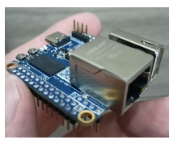

Потом пришла идея "Надо сделать очень компактный промышленный одноплатник". 

Откуда такие идеи ? Потому что реально нужно "воткнуть" в шкаф на DIN или прикрутить к стене и забыть. У нас уже
есть платформа, для котрой не надо охлаждения (NAPI), теперь надо превратить ее в законченный продукт.

## Классическая плата

В классическом случае мы паяем NAPI ножками вниз от процессора, но тогда девайс, куда она вставляется получается "высокий" (как минимум на высоту ножек). 

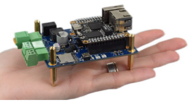

Как правило, такая высота всех устраивает, но мы хотим сделать совсем компактно..

## Как сделать "тонко" ? 

Воспользуемся тем, что ножки NAPI можно паять на любую сторону. 

Если мы перевернем ножки, мы не сможем "вставить" ножки в слоты, потому что нам "мешает" Ethernet и USB. Так вот наша незамысловатая 
идея состоит в том, чтобы вырезать в несущей плате места под разъемы, чтобы плата максимально "утопла" и сам девайс стал максимально "плоским".

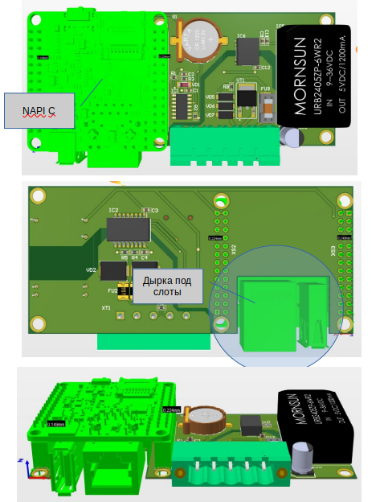

<!--truncate-->

## Корпусирование

Корпус разработали тоже мы. Он должен быть максимально простым, прочным, компактным.

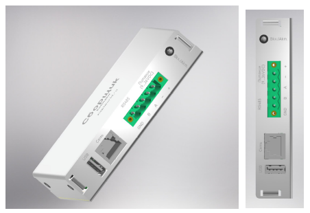

## Воплощение

### Плата с модулем

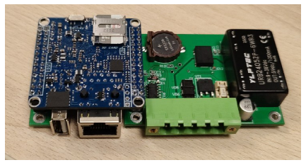

### Корпус

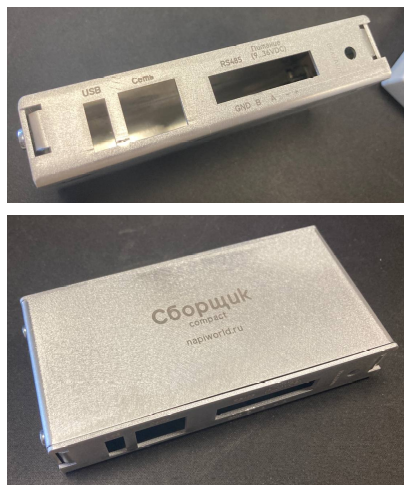

Получилось довольно компактно, сравним с пачкой сигарет.

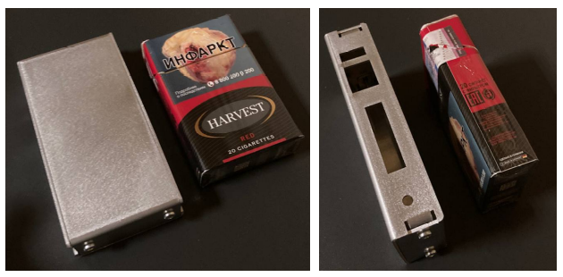

И в добрых руках инженера

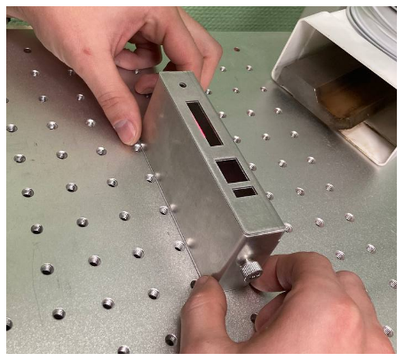

### Итоги

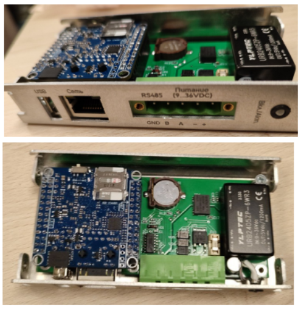

В закрытом виде

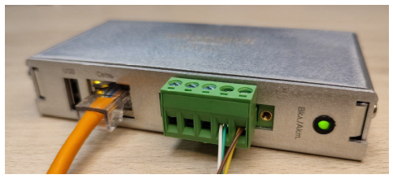

И, наконец, в элеткрощите !

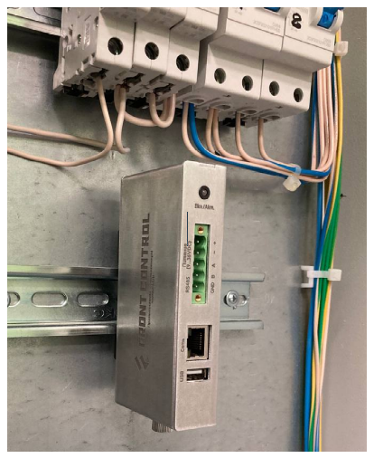

Приступаем к тестированию и "доведению" до изящества.