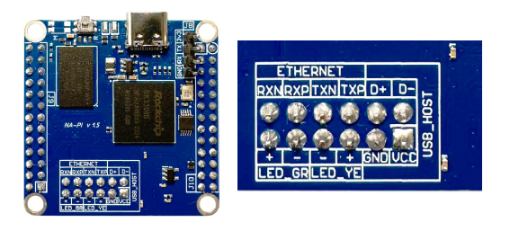

Первый взгляд на процессорный модуль Napi C.

<!--truncate-->

## Краткая предыстория

Сначала была Napi. По сути это одноплатный компьютер с GPIO и интерфейсами на удобных "ножках". Преимущества такого подхода очевидны - все сложные скоростные интерфейсы уже подготовлены и не требуют реализации на основной плате. Однако, это накладывает ограничения на форм фактор оконечного "девайса" - надо планировать разъемы Ethernet\USB в определенном месте. Хотя у нас есть уже несколько изделий на NAPI, мы хотели обойти эти ограничения. 

Эту NAPI мы маркируем Napi C (Classic)

### Штырьки вместо разъемов

Идея наша довольно банальна - заменить Ethernet\USB штырьками на тех же местах, минимально изменяя плату. 

Так у нас появилась Napi P (Pins).

## Что это дает

Мы разработали плату с слотом PCI-E на основе Napi P. На этой плате
располагаются разъемы Ethernet и USB в удобных для нас местах.

Это позволяет более гибко располагать элементы на плате (нам надо расположить разъемы на одной стороне, потому что мы планируем использовать плату в электрощитах).