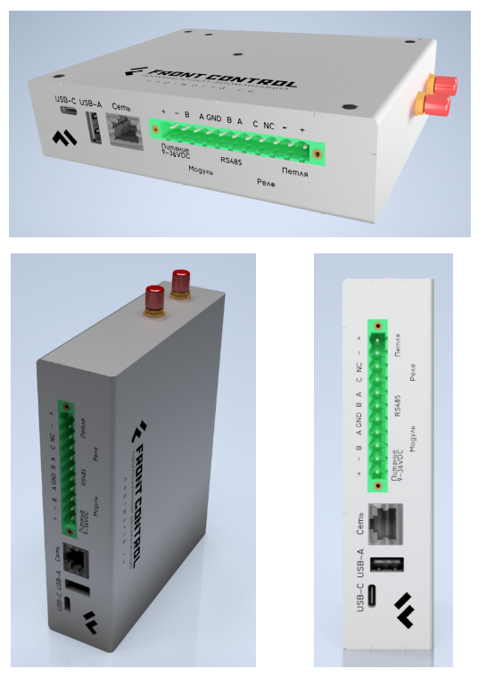
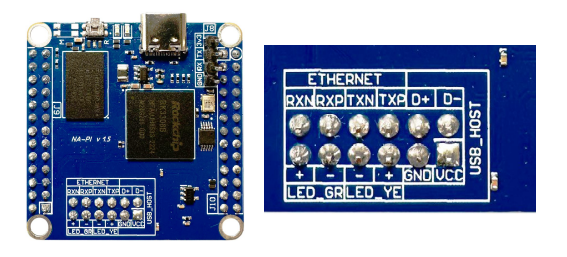
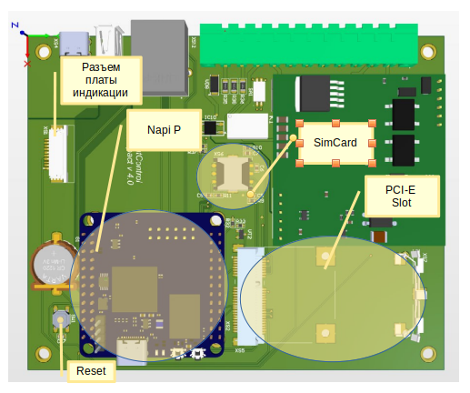
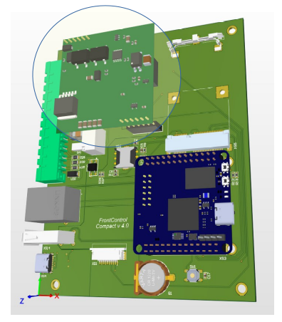
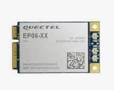
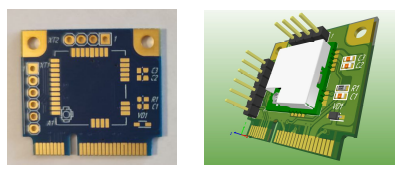
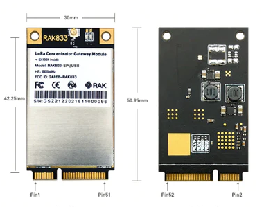
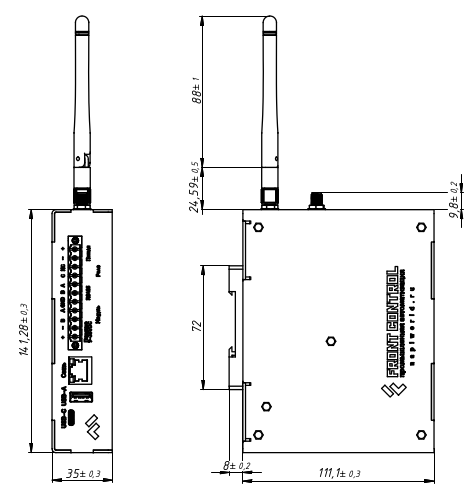

Представляем концепцию универсального Сборщика (Сборщик-Универсал)

## Концепция

В нашем устройстве Сборщик-компакт мы решаем задачу сбору данных, хранения и передачи их по сети Ethernet. Однако, зачастую в промышленной автоматике нет возможности "протянуть" сеть до каждой точки сбора. Поэтому логичным решением было сделать версию Сборщика с сменяемыми модулями беспроводной связи. Решение было реализовано в виде преобразования одного из USB интерфейсов в PCI-E слот на плате и использовании как готовых модулей, так и собственных.

Мы уже сделали демо-плату с PCI-E для тестирования модулей и собственный модуль Lora. Однако, она был скорее для разработки, чем для боевого применения, мы даже не стали его корпусировать. И вот, наконец, мы можем заявить что концепция Сборщика с модулями связи готова. Мы также протестировали LTE-модемы и собственный LORA-модуль.

<!--truncate-->

Внутри - модуль NAPI P

И материнская плата

Наш конструктив предполагает модульную плату питания, чтобы в зависимости от конфигурации выбирать тип питания (с POE или без).

## Что мы добавили

- Второй интерфейс подключения модулей rs485 
- Реле - сухой контакт (нормально закрытая группа)
- Шлейф сигнализации охранный, на обрыв (без контроля целостности линии)
- PCI-E слот для модулей расширений (LTE\LORA\Zigbee)
- Питание 10-60В
- POE с поддержкой стандарта 802.af
- Консоль (Type-c)
- Два выхода под антенны (SMA)
- Вывод на плату индикации

## Модули связи

Мы протестировали и сделали Веб-интерфейс к нескольким популярным модулям связи (LTE, LoraWan)

- LTE модем EP06 - один из лучших модемов 

- LORA модем

- LORA базовая станция

:::tip ЭТО ИНТЕРЕСНО

В зависимости от модуля меняется функционал устройства, но не его конструктив ! 

:::

## Конструктив 

Мы постарались сделать Сборщик максимально "плоским" для установки на DIN рейку в коммуникационные и электро шкафы. Конечно, он не такой компактный как "Сборщик-компакт", но для такого устройства, тоже весьма достойный результат.

В настоящее время у нас готовы модули NAPI P и платы сборщика. Также на Сборщике-демо мы протестировали работу модулей связи и создали интерфейсы NapiConfig. 

... Продолжение следует...