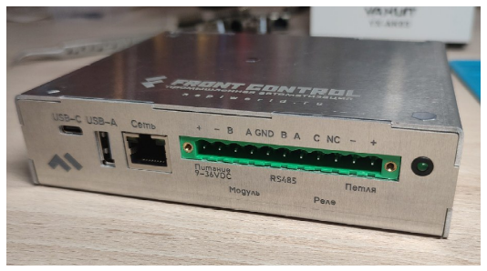
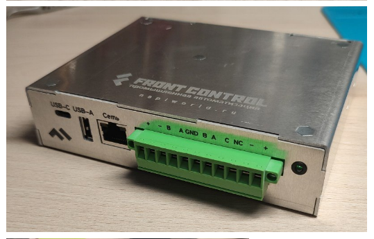
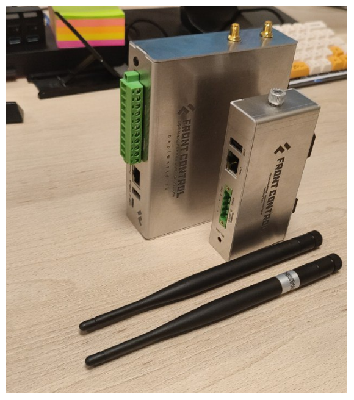
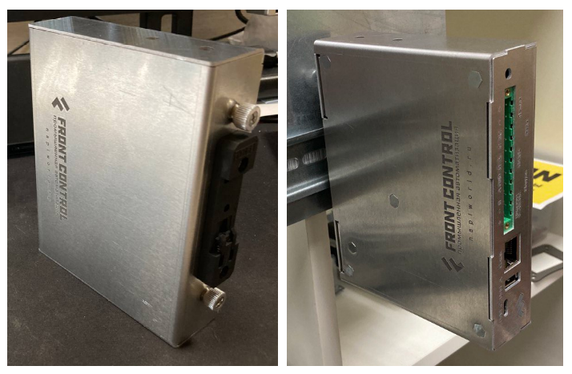

Ранее мы представляли концепцию Сборщика, а сейчас готовы показать первый фотки. Это неофициальный сайт, поэтому можем позволить себе поделиться фотками с полей. 

## Первый взгляд "живьем"

Вот такой первый экземпляр.

С "колодкой" с интерфейсами.

<!--truncate-->

## Сборщик-универсал и Сборщик-компакт

По толщине получились практически одинаковые устройства. 

## Крепление на DIN

Ну и традиционно мы все хотим крепить на DIN рейку.

