## Объекты эксперимента

### WiFi Роутер NetGear ORBI RBRE960

Куплен был по следующим причинам:

- Поддержка Wifi6 (именно 6ГГц диапазон) 
- Наличие порта 10Гбит (почему-то WAN)
- Наличие порта 2.5гбит (всего один порт LAN)

Порты распределены загадочно, но наличие портов больше 1Гбит дает надежду на высокие скорости.

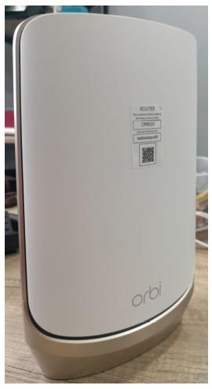

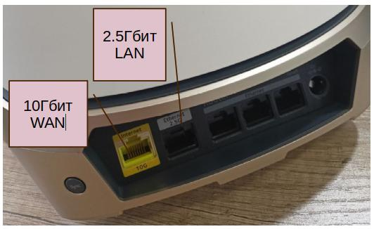

### Ноутбук под управлением ArchLinux с картой Intel AX210

Была куплена карта Intel AX210 (2,4G/5G/6G) с поддержкой 6Ггц изъята из "компьютерного" корпуса и засунута в ноутбук HP.

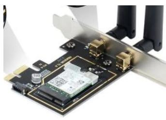

### Компьютер под управлением OpenSuse с картой Intel AX210

Карта была куплена на AliExpress и как есть вставлена в материнскую плату компьютера.

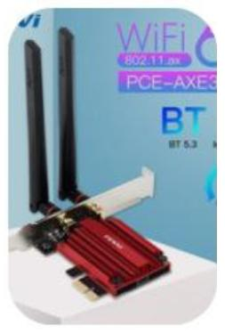

### Ноутбук под у управлением Ubuntu 22.04 c карта Ethernet 2.5Гбит

Для тестов "на проводе" задействовали карту в USB3.0

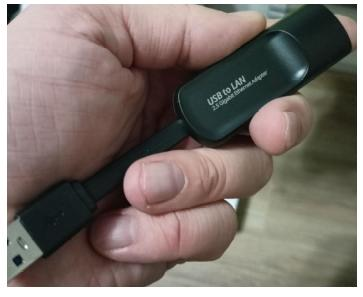

### Ноутбук под управлением Ubuntu 22.04 с картой wifi5 (5.2Ггц)

Стандартная wifi карточка Realtek в ноутбуке HP

## Методика тестирования 

Использовались три теста

1. iperf3 в один поток
2. iperf3 в 8 потоков
3. Скачивание файла 4Гбайт по протоколу http (программой wget)

## Первый тест "Разминка". WiFi5 5Ггц.

Для начала был проведен мини тест на WiFi5 (5.2ГГц), который сразу показал очень низкую скорость. Надо признаться, что эфир на 5Ггц у нас в БЦ довольно "захламлен", оптимизаций каналов не проводилось, потому что основной интерес лежал в области WiFi6.

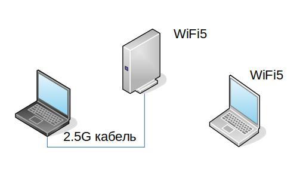

<!--truncate-->

### Результаты-1

- iperf3 один поток и 8 потоков

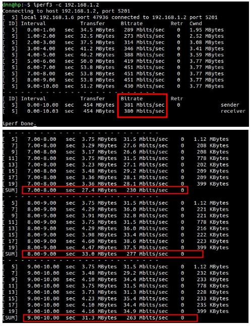

Итак мы получаем "скачущий" результат от 263Мбит\с до 451Мбит\с.

- wget (скачиваем большой файл)

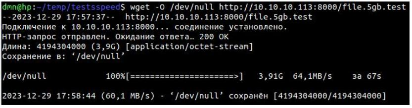

Получаем скорость в районе 480Мбит\с

>Так как нас интересуют скорости побольше (выше 1Гбит\с), было решено время на WiFi5 больше не тратить. Высоких скоростей  (больше 1Гбит\с) в этом диапазоне достичь нереально, поэтому нас жгуче интересует более высокоскоростной диапазон 6.2Ггц.

## Тест "Проверим кабель"

Для того, чтобы убедиться что мы НЕ упремся в кабельное соединение,
а беспроводное необходимо сначала проверить скорость по Ethernet. 

Была собрана нехитрая схема роутинга через NetGear

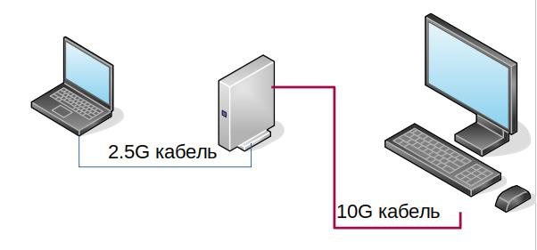

### Результаты-2

- iperf один поток

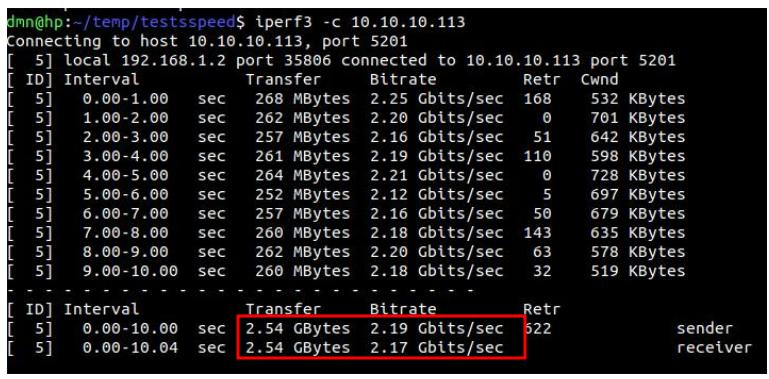

>Видим результаты больше 2Гбит\с

- iperf 8 потоков

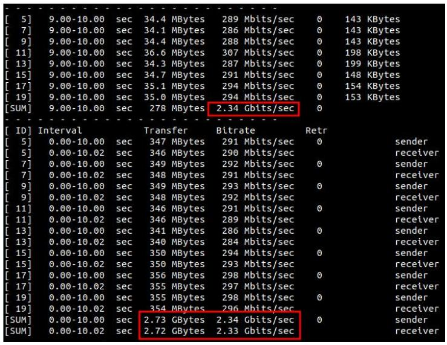

> Видим результаты, близкие к возможностям карты 2.5Гбит\с.

- Передача большого файла (wget)

:::tip Внимание: нестабильный результат

Тест по передаче файлов оказался весьма нестабильным и сильно "скачет" от раза к разу. Притом, что это проверялось на протоколах http, ftp, ssh. Однако, так как часть наших проектов связана с быстрой загрузкой файлов с регистраторов, нам важно делать эти замеры и мы приведем их здесь. Думается что влияет и загрузка ядер, инициализация передачи файла, кеширование и так далее. Возможно, это тема отдельного исследования.

:::

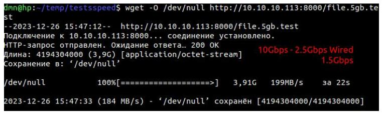

>Отметим, что результаты слабые. Однако приведем еще несколько практически аналогичных тестов, которые показали иные результаты.

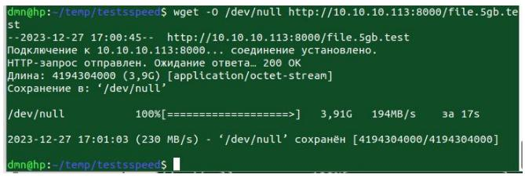

Рекордный результат был получен при скачивании файлов на платформу NXP LX2160, скорость приблизилась к 2,25Гбит\с.

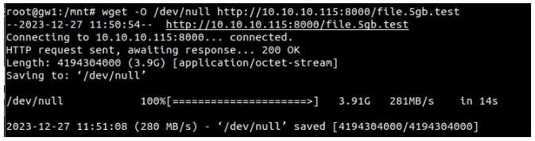

:::tip Важно

Мы специально провели аналогичные тесты без NetGear (через коммутатор) и получили такие же "плавающие" похожие результаты.

:::

Также мы проверил пару тестов передачи файлов по ftp, ssh и через протокол netcat. Файлы передаются также или медленнее !

- Передача через ftp

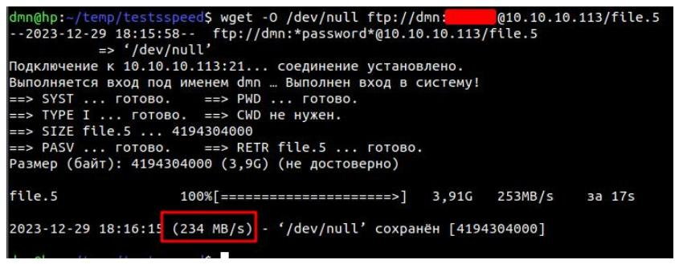

- Передача через netcat

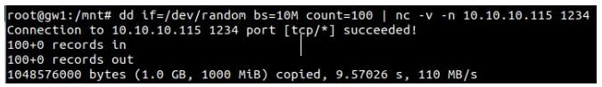

- Передача через ssh (scp)

А может просто выше скокростей не бывает ? Мы провели "тест" внутри одного ноутбука (когда клиент и сервер на одном устройстве) и смотрите какие результаты !

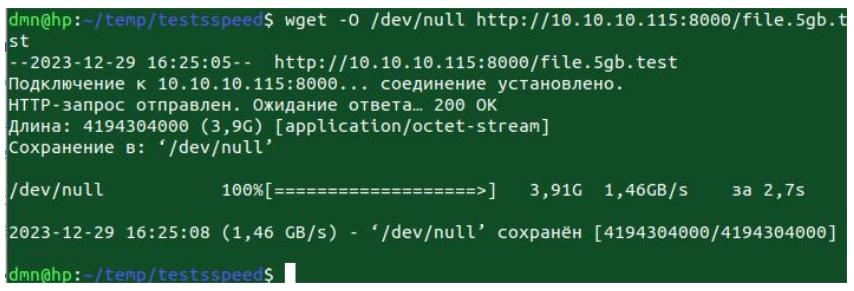

Это скорость 11.5Гбит\сек. 

>Так что есть надежда, что мы измеряем именно сеть !

## Тест WiFi6 (компьютер) - Ethernet 2.5Gb (локалка)

Нехитрая схемка.

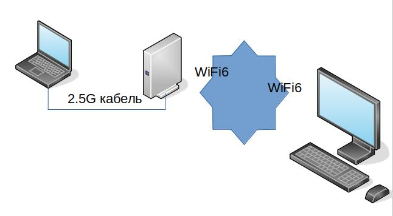

Убедимся что у нас таки WiFi6

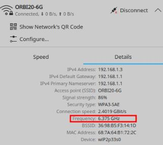

### Результаты-3

iperf3 один поток

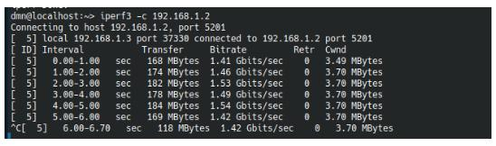

iperf3 8 потоков

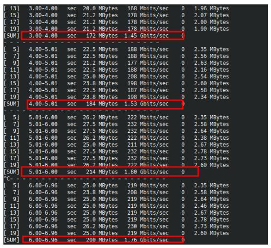

Итак **наконец то** мы видим приличные скорости, но не те, что нам обещали маркетологи конечно.

>Результат **1,41 - 1,76 Гбит\с** гораздо ниже заявленного >рекламного, но гораздо лучше WiFi на 5Ггц. Мы также видим, что мы не упираемся в локальную скорость по кабелю 2.5Гб и даже не приближаемся к ней.

Вытянем длинный файл (4Гб) с ноутбука с Ethernet через WiFi6.
Чтобы не тормозить записью на носитель пишем в `/dev/null`

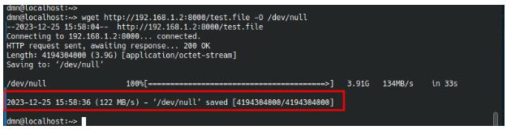

Получаем 122Мб\с что соответствует 122*8= **976Кбайт\с**. 

## Тест WiFi6 (ноутбук) - Ethernet 2.5Gb (локалка)

Для чистоты эксперимента возьмем другую карту WiFi6 (которую мы "встроили в Ноутбук)

Нехитрая схема. Ноутбук у нас под свежей версией ArchLinux.

Какие отличия от предыдущей схемы

- На карте wifi нет радиатора, она вставлена в слот M2
- Другой Linux (а вдруг)

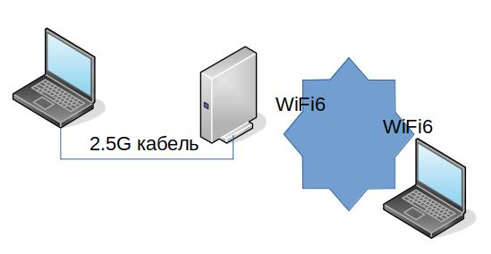

Убедимся что мы в WiFi6

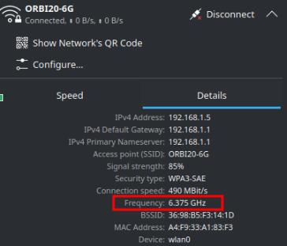

### Результаты-4

- iperf3 1 поток

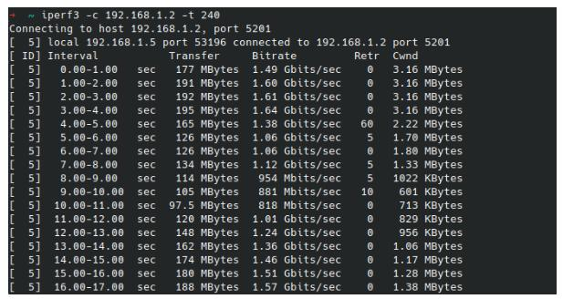

>Мы видим падение скорости 1.49Гбит - 0,818Гбит (может нагрелась карточка), но далее идет возвращение к 1,57Гбит. 

- iperf3 8 потоков

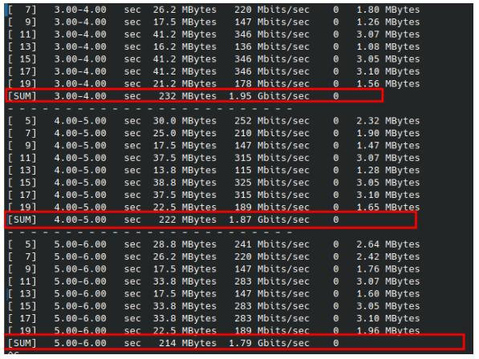

>Мы вдруг видим рекорд скорости - **1,95 Гбит\c** и лучшую в среднем скорость, чем с компьютера. И пока это рекорд.

- wget

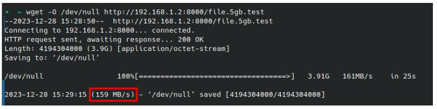

>Скорость 1,27Гбит\с. Однако, мы помним, что в тестах wget скорости сильно "плавают" от теста к тесту. 

## Тест WiFi6 - WiFi6

Теперь проведем интересный тест, когда оба девайса на Wifi6.

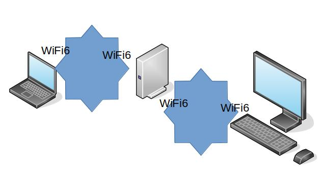

На обоих хостах был запущен iperf3 в режиме клиента и сервера одновременно.

- iperf3 в один поток

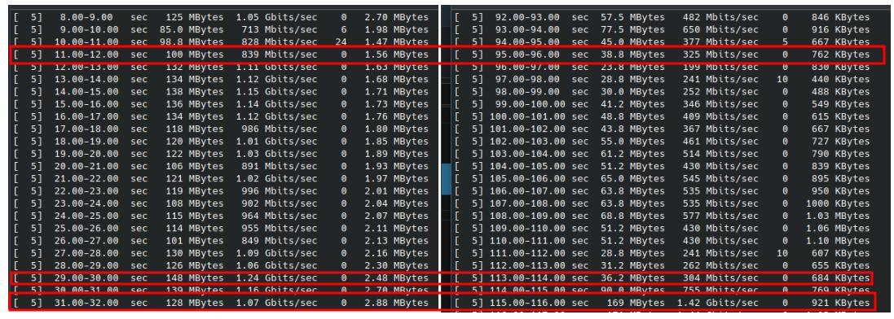

>Видно,как отчаянно точки "сражаются" за канал. Видно, что проседает больше одна точка, чем вторая (возможно процессор мощнее). Видно, что агрегации нет, точки делят всю ту же полосу 1,5-1,9Гбит.

>Также в последней сточке получилось рекордное "суммарное", но моя гипотеза состоит в том, что один уже закончил тест и второй "хапнул" все. Однако требует более длительного теста, чтобы это подтвердить. 

Прогоним большой файл одновременно с двух хостов

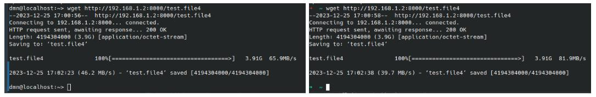

>Здесь более четко видно, что полоса (1.2-1.7Гбит\с) поделена между хостами в не очень равных долях.

## Тест MESH-сети

Спустя месяц ожиданий к нам приехал еще один модуль Netgear, к удивлению он оказался упрощенным устройством для Mesh сети (Netgear Sattelite). Он не богат на настройки и единственная его функция быть репитером основного роутера. Мало того, у него не  10Гбит проводного интерфейса, только 2.5 и 1Гбит. Но проверить было интересно, что такое MESH сеть в понимании Netgear. 

Поэтому была собрана следующая схема. 

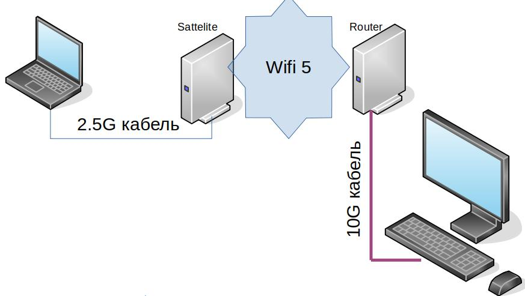

## Выводы пока такие

- Максимум что может дать WiFi на 6.2Ггц это скорости передачи данных в диапазон 1,2-1,7Ггбит, ближе к нижней границе. Передача файлов происходит на более низкой скорости и сильно зависит от
Linux, файловой системы, загрузки ядер и тп. Мы сделаем более чистые тесты по передаче файлов.

- Для бытовых применений это очень хорошие скорости. Файл 4,2Гбайт передается за 30секунд. Однако для построения магистральных сетей, меш сетей, опорных сетей требуются другие скорости и, вероятно, другие частоты, например диапазон 60ГГц, где подтвержденная скорость передачи данных 3,5Гбит full duplex, и диапазон 80Ггц, где подтверждены скорости 10Гбит\с full duplex. Однако, следует признать, что оборудование на таких частотах на порядок дороже.

<!--truncate-->