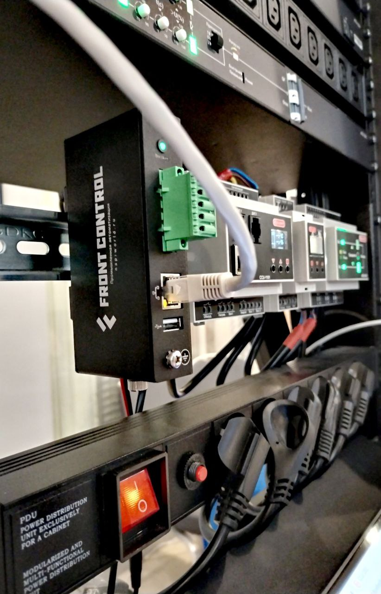
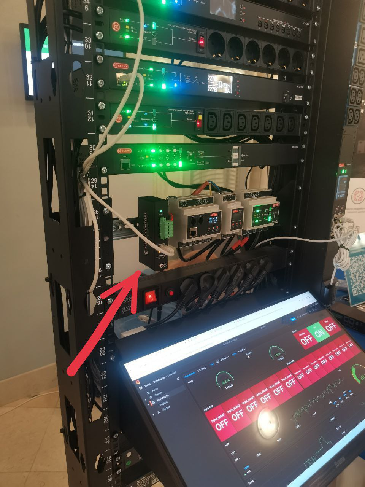
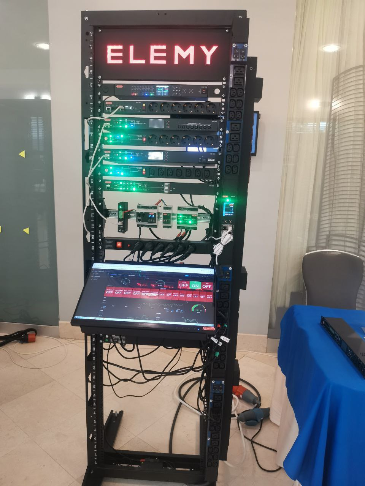

## Наше устройство на выставке 

>Видео-демонстрация возможностей  анализа данных с устройств
>https://youtu.be/2gW4XfBO398

На выставке по ЦОД мы работаем совместно с замечательными продуктами наших партнёров ELEMY. 

Сборщик  по SNMP собирает статистику с устройств (ATS-1204, ATS-1205, CCU-002, PDU-1502) в стойке. На выставочном компьютере запущена Grafana с отображением статистики и состояний не только текущих данных со всех устройств стойки, но статистики за любой период наблюдения (т.к. Сборщик всю информацию хранит в базе данных).

