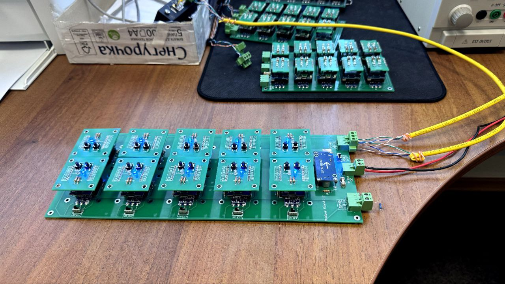
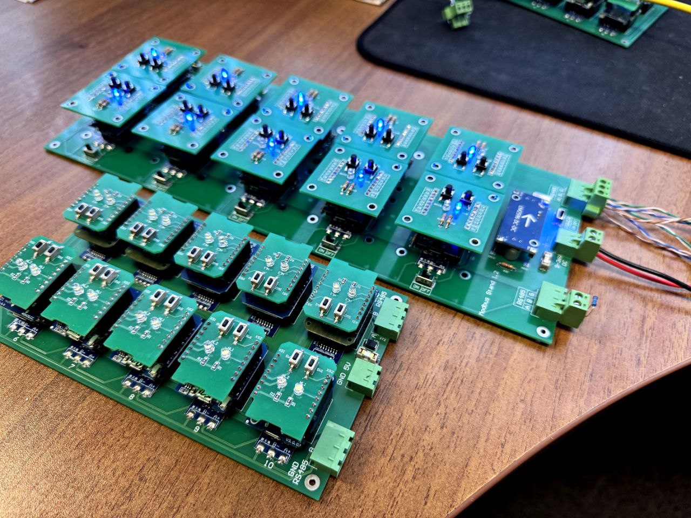
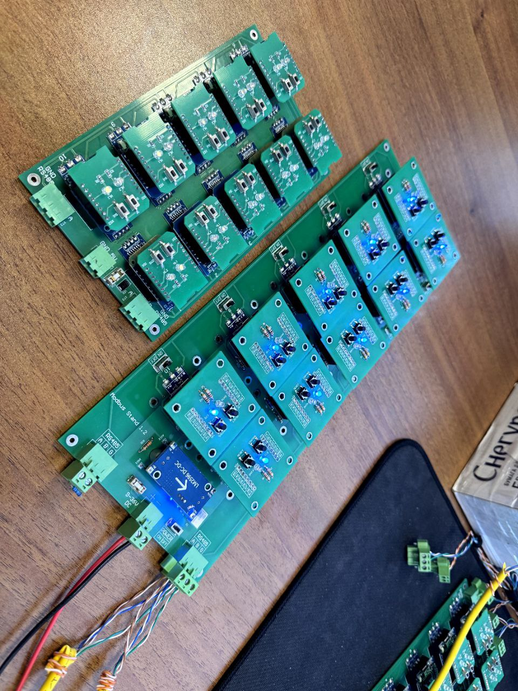
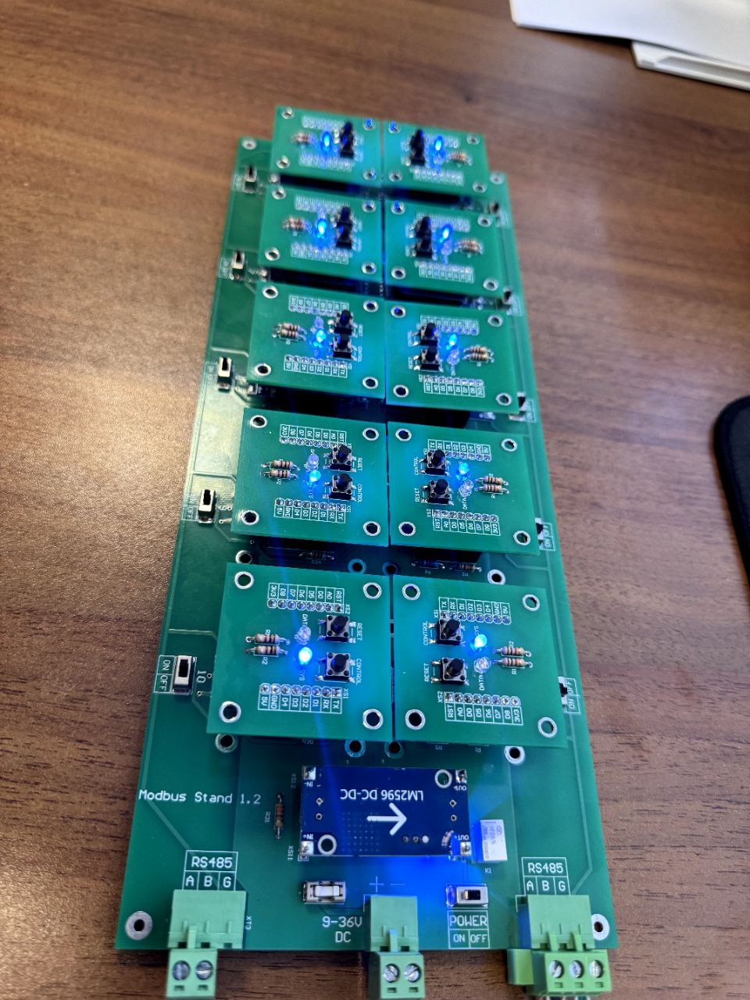
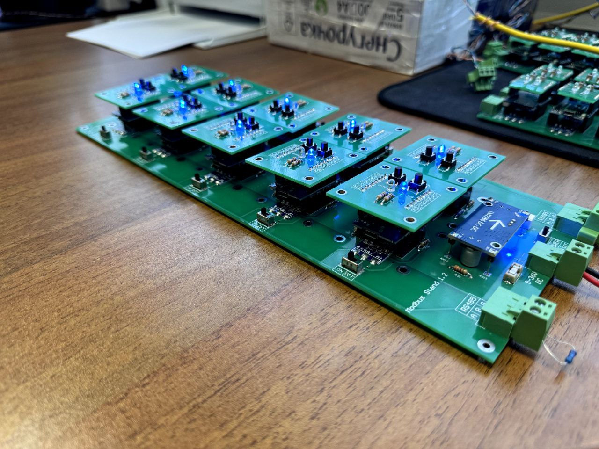

## Новое в железе ModbusStand 2.0

- Питание 4-40в;
- Возможность отключить\включить каждый датчик;
- Возможность "притянуть" Wemos\Шилду к плате через крепление
- Все элементы подобраны под навесной монтаж (для самостоятельной сборки)

## Новое в софте

>Прошивка для Wemos: https://github.com/lab240/esp8266-modbus-stand/tree/dev1
>Утилиты тестирования, даш борда для Grafana, конфиги для Telegraf: https://github.com/lab240/modbus-stand-tools

Открытая прошивка для Wemos позволяет

Скетч для среды Arduino IDE \ VC позволяет (настраивается без прошивки)

- Назначать Modbus адрес
- Менять количество hold-регистров и coil-регистров
- Менять скорость и параметры RS485 порта

<!--truncate-->

Заполнение регистров

- Hold-регистры заполняются следующим образом: 
  - 1-й регистр - modbus адрес
  - 2,3,4 - секунды, минуты, часы со старта
  - 5 и далее - случайные числа от 1 до 320000
- Coil-регистры заполняются случайно (1 или 0)
  

## Как выглядит стенд

Новый стенд

Стенд 2.0 vs 1.0

