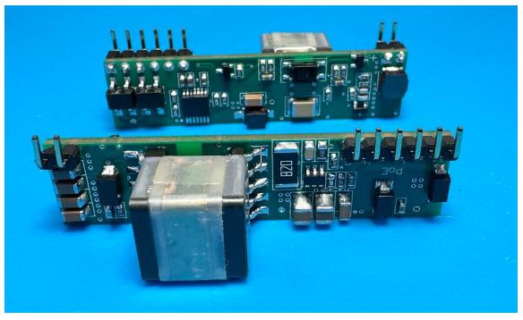
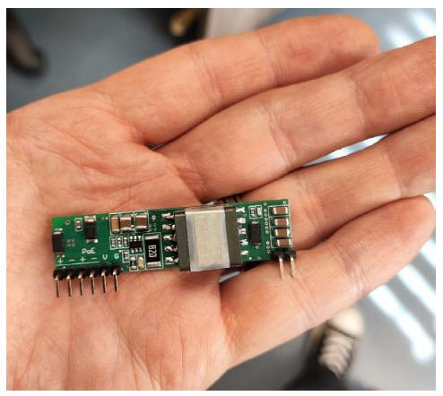
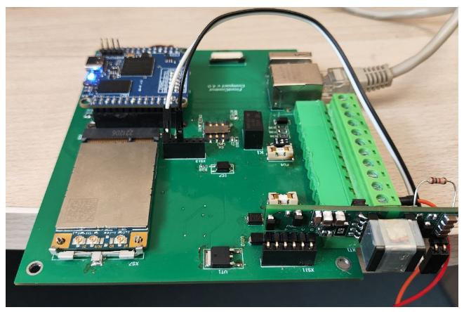

## Плата питания для Embedded устройств

Мы решили унифицировать питание для наших устройств и разработали плату питания, учитывая все возможные ньюансы (в частости, доступность компонент и цена изделия). 

- Вход 10-60в DC (постоянное напряжение) либо PoE  802.3at
- Вход переключается DC-POE, DC в приоритете 
- Выход 5в 2-2.5А

>Наконец-то мы поддерживаем POE  802.3at с автоматическим определением источника 
  

<!--truncate-->

## Размер

Компактный размер

Вертикальное расположение платы должно экономить размер головного устройства !

В настоящее время мы проводим испытание на нагрузку и нагрев и скоро эта плата 
станет частью нашего Сборщик-Универсала. 