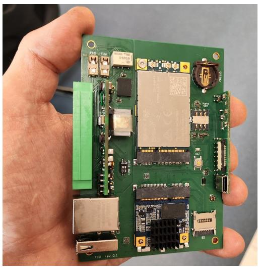

На сайте napiworld.ru мы сделали первый обзор нашего Сборщика-Универсал

## Почему этот пре-релиз для нас важен.

1. Это устройство на нашем компактном SOM Napi Slot. Надеемся, что на этом SOM будут не только наши устройства и нам было важно выпустить свое устройство с лучшими практиками.

2. Это устройство с нашей универсальной платой питания DC \ POE, про которую мы уже писали. И ее тоже важно было применить в разработке.

3. Это устройство с нашим модулем расширения не только под USB, но и под UART и  I2C.

4. Это устройство c микроконтроллером, где мы реализуем WatchDOG и другие интересные функции.

>:fire: https://napiworld.ru/blog/dmn-fcu-first-view

## Другие ссылки

>:point_up: Документация по Napi Slot: https://napiworld.ru/docs/napi-som-intro \
>:point_up: [Аннонс](/blog/power-plate) про плату питания.
