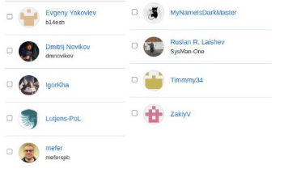

# Комьюнити

Наше комьюнити - это главное. Решать различные задачи от программирования до корпусирования - наша сильная сторона. Обычно группа делает или определенный проект (продукт), или работает в определенной нише (с определенным стеком как сейчас модно говорить). Наш стек - от трассировки микросхем, до пользовательских интерфейсов на JavaSсript (React, Vue).

Многие и нашей команды ведут собственные проекты на github или частвуют в открытых проектах.

Состав нашего комьюнити постепенно растет и сейчас у нас порядка 13 постоянных человек в команде + привлеченные специалисты. В каждом сегменте у нас уже есть тимлид, который менторит и обеспечивает свой участок работ.

- Группа схемотехников (+тимлид)
- Группа сетевых инженеров (+тимлид)
- Группа проектирования, подготовки и выпуска документации (+тимлид)

Смотрите портфолио нашей команды.

