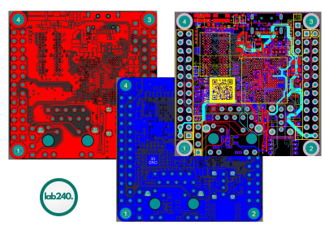
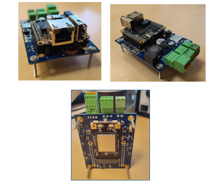
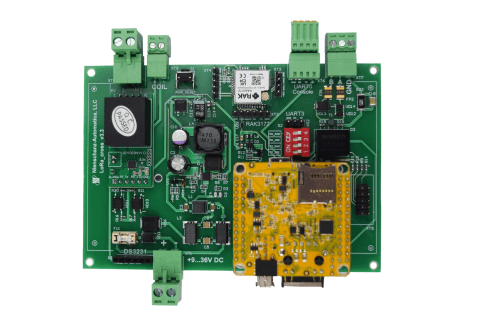

# Портфолио. Электроника.

- Процессорный модуль [NAPI](https://github.com/dmnovikov/napiguide/blob/main/readmeNapi.md) на основе Rockchip RK3308
  

- Система сбора данных ["Сборщик-компакт"](https://github.com/dmnovikov/napiguide/blob/main/frontcontrolcompact.md) на основе Napi

- Система сбора данных ["ТокоСборщик"](https://github.com/dmnovikov/napiguide/blob/main/readmeNapiFrontControl.md) на основе Napi

- Промышленный коммутатор [FrontNet](https://github.com/dmnovikov/napiguide/blob/main/frontnet-l2.md) на основе ASIC Broadcom Avenger.
