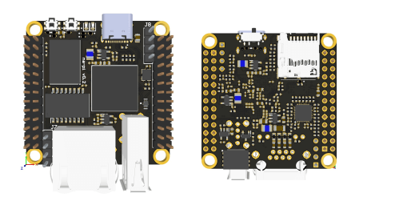

# Портфолио. Hardware.

## Процессорный модуль NAPI C\P на основе Rockchip RK3308

Ссылка: https://napiworld.ru/docs/napi-intro

  

## Процессорный модуль NAPI S

Ссылка: https://napiworld.ru/docs/napi-intro

## Сборщик компакт

Ссылка: https://napiworld.ru/docs/computers/frontcontrol-compact

## Сборщик универсал

Ссылка: https://napiworld.ru/docs/computers/frontcontrol-uni

## Система сбора данных ["ТокоСборщик"] на основе Napi

Ссылка: https://napiworld.ru/docs/special/frontcurrent

## Modbus стенд

Ссылка: https://napiworld.ru/software/intructions/mbusstand/

