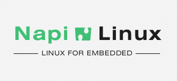
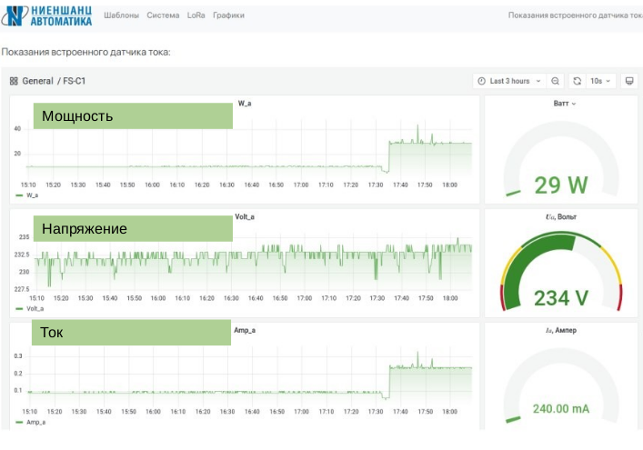

# Портфолио. Программные разработки.

## NapiLinux - дистрибутив Linux для встраиваемых систем (на основе системы сборки Yocto)

[Подробнее о NapiLinux](https://github.com/dmnovikov/napiguide/blob/main/napilinux.md)

  
## Веб интерфейс "Токо-сборщик" (система статистики на основе influx и grafana)

  
## А также...

- FrontNet Lora connect - система передачи данных через LoraWan сеть с резервированием данных на основе ChirpStack
  
- "Flear path protocol" - роутинг движущегося объекта на основе Linux и DPDK
  
