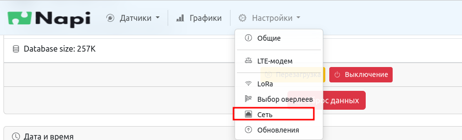

# Портфолио. Software.

## NapiLinux - дистрибутив Linux для встраиваемых систем (на основе системы сборки Yocto)

Ссылка: https://napilinux.ru/

## Веб интерфейс "NapiConfig" 

Ссылка: https://napilinux.ru/napiConfig

  
##  Другие проекты

- NMS (Network Management System) для систем радиорелейной связи

- Разработка API и Веб-приложения управления беспроводными модулями связи

- Разработка элементов ячеек MESH сети на основе Linux-маршрутизаторов

- FrontNet Lora connect - система передачи данных через LoraWan сеть с резервированием данных на основе ChirpStack

## Система передачи данных "Поезд-Земля"

Ссылка: https://lab240.github.io/blog/dmn-prj-fleapath-1

В большом проекте по обеспечению надежной высокоскоростной (10Гбит\с) связью "поезд-земля", наша команда отвечает за разработку решения для высокоскоростной передачи данных со сверх быстрым переключением каналов (в сотовой связи аналогом является механизм переключения радиотракта между БС и МС, "перехват", он же - "handover").

Мы разрабатываем собственный протокол "Flea path protocol" -протокол управления маршрутами движущегося объекта на основе Linux и DPDK. 
