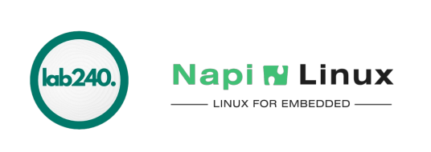

## Комьюнити lab240



:::tip самое интересное

Сатьи, заметки, рецепты, жизненные факты (то есть самое интересное) мы публикуем в [блоге](/blog/).

:::

Наше комьюнити занимается исследованиями и созданием продуктов в области электроники, сетей, Linux, embedded, iot, автоматизации.

Мы договорились, что вне зависимости в каких организациях кто оформлен, мы работаем вместе над одними и теми же проектами, грамотно
распределяя ресурсы, компетенции и имеем общую систему управления проектами.

Такой подход позволяет решать сложные задачи, преодолевать кризисы, и растить свои технологии,
которые применяются во всех проектах. Как пример, это дистрибутив NapiLinux, который мы применяем буквально во всех
проектах связанных с Linux и свободным ПО, семейство протоколов на основе DPDK, драйверы и сборки ядер.

## С чем мы имеем дело каждый день

:boom: Работаем с чипами и сборками RockChip, NXP, BroadCom, RAK.

:boom: Глубоко и широко "пилим" Linux, готовим ядра, рецепты, загрузчики, сетевую систему.

:boom: Работаем с DPDK и разрабатываем свой протокол на основе DPDK.

:boom: Пилим свой вариант SDN сети для одноранговых MESH-сетей 802.11ad(ay)

:boom: Пилим технологию гарантированной передачи больших данных в сети Lora (ChirpSack и компания)

:boom: Проектируем в Компас, Altium Designer, EasyEDA.

:boom: Пишем документацию в ЕСКД (когда требует проект)

## Что на этом сайте ?

> **/job**
> Присоединится к команде: <http://t.me/dmn240>
> **:wq**

> **/info**
> [Статичные странички о нашей команде и проектах](./docs/intro/)
> **:wq**

> **/events**
> [События и всякие интересности в блоге](./blog/)
> **:wq**

## Ну зачем этот сайт ?

```c title="/etc/welcome"
const char* sometext= R"
Мы нашим небольшим комьюнити делаем действительно интересные вещи. 
От проектирования новых устройств, до создание своего дистрибутива Linux и системы управления Mesh-сетью.

Наша команда распределена географически, функционально и по проектам, однако, 
нам важно быть единой командой для нас самих в первую очередь. 

Ну, и конечно, мы ищем в комьюнити соратников как на постоянной основе, так и на проекты  и конкретные задачки. 
Чтобы было понятно кто мы и что мы - будем открывать наши проекты и наши успехи.

Мы понимаем, что людям важно участвовать в интересных проектах, быть на острие технологий и работать в понятной команде - 
поэтому мы создали этот небольшой сайт, чтобы приоткрыть дверь и показать что делает комьюнити lab240.
";

void main(){
    // printf(sometext); это не по с++ ному =)
    std::cout << sometext;
}

```
